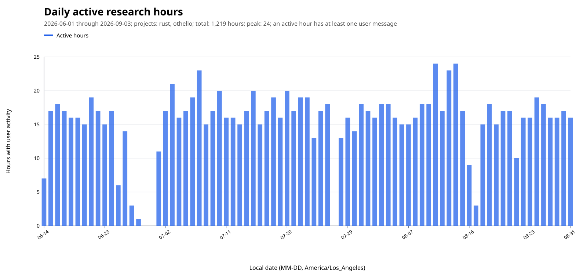
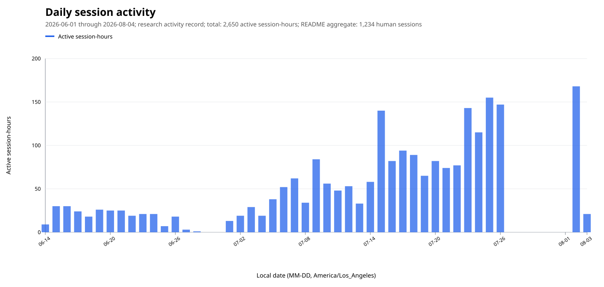
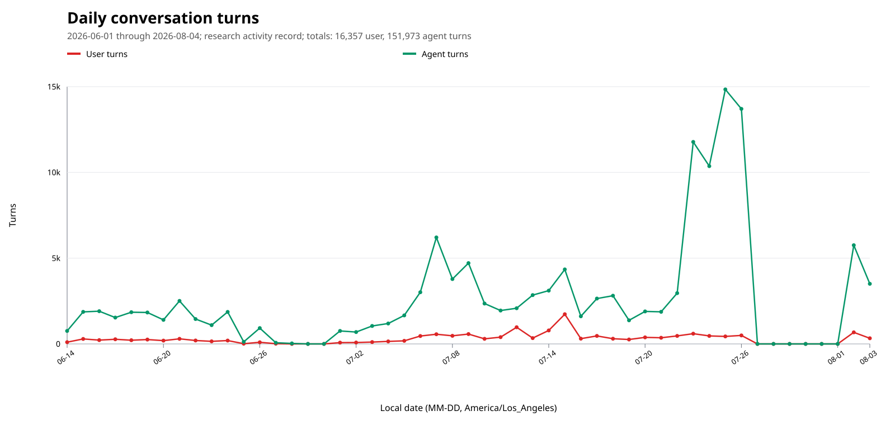
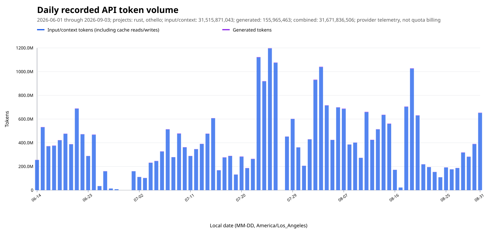
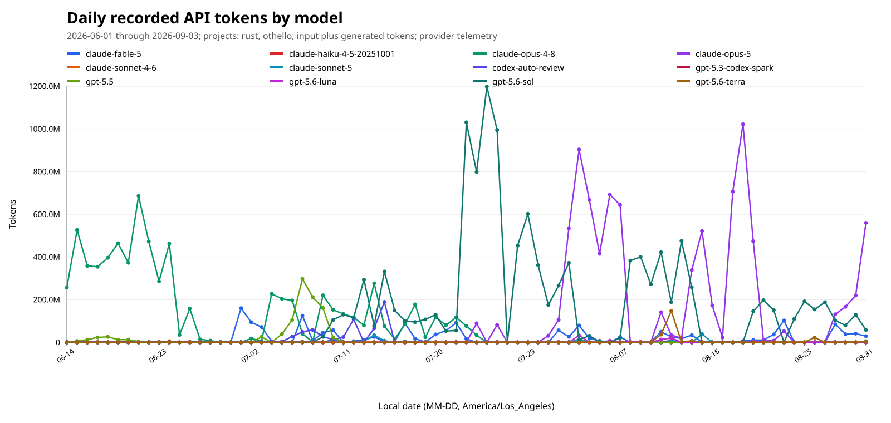

# Research Method and Program Context

This companion document records the human–AI workflow, discovery method, research volume, and broader context behind the public mathematical papers. It is provided as background rather than as evidence for the results; the README and paper repositories are the appropriate starting points for the mathematics.

## How the program developed

The present program began in mid-June 2026 with exact search in board games.  An
Othello engine led to a solver for the non-attacking-queens game.  Viewing a
queens position as a set of points constrained by attack lines shifted the
question from “who wins?” to the incidence structure of legal positions: which
points can coexist, what their secants cover, and when local constraints force
a global configuration.  That shift produced the finite-geometry and coding
branches represented here.

Coding theory supplied the main inverse problem.  Several papers start with a
thin observable layer—deep holes, syndromes, or minimum-weight codewords—and
ask whether it determines the code or geometry that produced it.  MDS and CSS
codes then provide a direct bridge to the quantum papers, where the analogous
question is which local transformations of an entangled state or encoded
operation are actually possible.

The Clebsch Series is the tightest meeting point.  Its papers examine related
six-coordinate structures through different losses of information: a
deep-hole locus, a conic matching quotient, arithmetic and operator shadows,
and the minimum-word layer of a binary conic code.  Reconstruction and
orientation recur throughout, as do a golden operator satisfying
`B² = 5I` and an associated cubic.  The exact identification of every cubic
realization is still part of the continuing program.  Clebsch V is in
preparation and is intended to further unify the findings and themes of the
preceding papers.

## Human direction, AI labor

AI was the workhorse.  OpenAI's GPT-5.6-Sol and Anthropic's Fable generated
literature leads, candidate conjectures, proof attempts, finite searches, code,
calculations, and red-team critiques.  Their speed made it possible to compare
many more routes than I could have explored unaided.

I was in the loop for every research session.  I selected targets, chose which
branches to deepen or kill, maintained the definitions and conceptual links
across subjects, and decided what could enter a paper.  Elementary questions
often exposed a hidden assumption; persistence after a plausible local answer
often opened the next branch.  The models supplied most of the volume of work.
I supplied the continuing research state, mathematical judgment, and final
responsibility for the claims.

That judgment was not a claim that I could instantly master every technical
detail.  There was too much subtle mathematics, spread across too many
neighbouring subjects, to reliably tell from one reading whether a result was
deep, routine, false, incomplete, or merely dressed up in impressive language.
The reports, independent model passes, named expert lenses, red teams,
formalization, and vibe summaries were therefore part of the reasoning
apparatus.  They helped expose distinctions I could not safely make unaided:
when a computation had become a theorem, when a theorem was weaker than the
claim, when a promising branch had run out of structure, and when an obstacle
was worth one more push.  My role was to keep asking those questions, compare
the answers, choose the targets, and remain responsible for what survived.

One useful description of this role is **coarse-graining**, borrowed from the
language of physics.  I could not hold every local calculation in view at
once, so I directed by pattern, intuition, conceptual unity, and research
vibe: which structures seemed to be recurring, which explanation felt like it
was becoming inevitable, and which branch was producing only more detail.
The detailed reports, formal checks, certificates, and adversarial reviews
then resolved the selected regions at a finer scale.  Vibe was the navigation
signal; it was never the proof.

A model response is never evidence merely because it is fluent or confident.
Literature leads must survive source checking; calculations must be reproduced
or certified; proof attempts must become arguments that can be read without the
session that produced them.  The next two sections describe how this division
of labor is organized and checked.

## The research method

Game-tree search is the organizing metaphor.  A branch may be a conjecture, a
choice of invariant, a change of field or parameter, a proof strategy, or a
translation into another subject's vocabulary.  The current state records what
has been proved, computed, falsified, or found in the literature, so a useful
branch can remain alive across many sessions without erasing the failures that
shaped it.

Small exact computations, symmetry tests, bounds, and quick literature probes
provide move ordering.  They decide where to spend the expensive work of a
general proof, exhaustive classification, primary-source audit, or
formalization.  Exhaustion has value only with a stated domain and stop
condition: within that boundary, a miss can expose a false conjecture, a sharp
obstruction, or the hypothesis a theorem was missing.

Obstacles receive one more pass before a branch is dropped.  A counterexample
may reveal the right invariant; an unexpectedly large stabilizer may identify
the correct equivalence relation; a failed bound may expose the parameter that
controls the problem.  This is “gem mining”: preserve the precise mathematical
content of the failure and feed it back into move ordering.  It is not a claim
that every dead end is valuable.

The working record shows the scale of the search behind the papers.  As of
August 3, the dated research-task files contain **1,086
reports and 272,634 lines**.  A report has **251.0 lines on average**, a median of
**198.5**, and a maximum of **3,747**.  They retain failed hypotheses, exact
domains, literature boundaries, and the state needed to resume or compare
branches.  The papers and linked artifacts, rather than this internal ledger,
carry the public claims.

## Tooling in the discovery loop

The program uses substantial custom tooling, but the tools have a specific job.
Finite-field and projective-geometry enumerators, symmetry and canonical-form
routines, code and graph searches, symbolic algebra, and small
quantum-information calculations are used to find patterns, test conjectures,
locate exceptional cases, and check that independently derived descriptions
agree.  Search logs preserve the domain, reductions, and stopping conditions;
certificate generators turn finite conclusions into compact objects that can
be replayed and checked separately.  Lean is used where a kernel-checked
formal statement gives a useful additional trust boundary.

The computational result is usually a waypoint, not the mathematical
destination.  Once a pattern is understood, the aim is to replace a large
table or opaque search with the shortest structural explanation available:
the invariant, orbit argument, factorization, dimension count, or elementary
lemma that makes the result inevitable.  Computation remains in the paper or
its supplement when it is the cleanest way to settle a genuinely finite
classification, and then its domain and certificate are made explicit.

This is deliberate: the goal is not drive-by computational mathematics, where
a program prints an answer and the reader is asked to trust the printout.  The
goal is beautiful, illuminating mathematics whose central argument a referee
or an interested reader can verify mentally, with computation and formal
certificates serving as discovery instruments and independent cross-checks.

The same standard applies to the papers themselves.  The aim is not only a
collection of interesting theorems and proofs, but finely polished expository
mathematics: clear definitions, economical arguments, motivating examples,
and a visible line from the central idea to the conclusion.  Milnor and Serre
are useful models here—not because these papers imitate their subjects or
style, but because they show how deep mathematics can remain precise, elegant,
and readable to someone entering the subject.

## What the extra passes were for

The most productive prompts were often not sophisticated.  A basic question
such as “what information is still present in the failures?” can force a
change of viewpoint: in the Clebsch work, a thin layer of error patterns became
enough to reconstruct the hidden code and its geometry.  Another recurring
move was to ask whether a tool or invariant developed for one paper belonged
in a neighbouring problem.  A syndrome-to-geometry dictionary developed in the
Clebsch program was carried into the AME--LU work; there it reduced a difficult
quantum-coding connection to a short structural lemma followed by two named
theorems.  The transfer was useful precisely because the common mechanism was
made explicit, rather than because the papers were being made artificially
interdependent.

The `ej` passes show a second kind of gain.  An initial computation may reveal
an unexpected spectrum or multiplicity, but the follow-up questions ask what
could force it: is there a hidden orbit decomposition, a representation, an
integral lattice, or an arithmetic order behind the numbers?  Successive passes
can turn a census into an invariant, an invariant into a factorization, and a
factorization into the proof's conceptual centre.  In the Golden work, this
was the route from a striking numerical pattern toward the underlying
arithmetic and operator picture already described in the paper.

These examples are representative rather than exhaustive.  The public papers
show the finished mathematics; many tempting branches, intermediate prompts,
and later-stage discoveries remain in the research record until they have
survived the same proof, literature, and exposition gates.

Some especially telling examples from the released work are:

- **“Do we really need to enumerate all the words?”**  In the q=11 coding
  case, a direct affine count became too large to be a satisfying proof.  The
  question led to a coefficient-level bijection and a small projective
  spectrum from which the published counts follow.  The computer check stayed
  as a cross-check; the paper carries the structural argument.
- **“Can a result from the neighbouring lane supply the missing dictionary?”**
  A low-degree Clebsch table was reused as seed data for the six-arc work, and
  the resulting identity was then promoted to a general theorem rather than
  left as a q=11 observation.  This is the kind of cross-pollination that the
  game-tree view is meant to make visible.
- **“Are these two attractive arrangements actually the same object?”**
  Asking that of the Clebsch and icosahedral descriptions led to an explicit
  projective identification, followed by a careful narrowing of the novelty
  claim: the classical geometry was credited, while the paired conic-filling
  synthesis remained the contribution.
- **“What is the next structural explanation?”**  In the Golden work, extra
  passes did not stop at an observed spectrum.  They successively tested orbit
  structure, representation-theoretic multiplicities, and arithmetic
  structure until the numerical pattern had an operator-level explanation.
  That is the characteristic `ej` progression: observation, invariant,
  mechanism, proof.

One of the earliest and most persistent targets is also a useful reminder that
this process does not guarantee a headline theorem.  The uniform odd-
characteristic projective-cap problem—the question of the outcome of the
avoidance game across all odd finite fields—remains open.  Individual fields,
dimensions, and geometric families have been settled, and the search has
identified sharp boundaries where attractive reply strategies fail.  More
importantly, the attack has generated hundreds of worthwhile branches: mirror
and involution methods, classical-variety families, conic and Schreier-graph
structures, exact small-field certificates, reusable solvers, and connections
to the coding and finite-geometry papers collected here.  Some failed
strategies even became theorems explaining why those strategies cannot work.

That is not a consolation prize or a relabelled solution.  The open cap
problem remains open.  It is an example of the intended research posture:
push a difficult question hard enough that its obstructions, neighbouring
theorems, and useful tools become visible, while keeping the unresolved core
clearly marked.

## Records, commands, and review lenses

The work is organized around short research reports rather than disposable
chat transcripts.  A useful report records the question and its definitions,
the current state, exact evidence and computational boundaries, attempted
routes and failures, literature checks, what was promoted or rejected, and the
next highest-value question.  This makes a long-running investigation
restartable and lets later readers distinguish a proved result, a checked
finite observation, a conjecture, and a promising lead.

Incidental findings are logged separately in an append-only discovery track.
That track preserves the exact provenance of a useful oddity without silently
turning it into an assignment or a theorem.  When an investigation closes, a
mystery ledger lists the features that were surprising or unexplained, records
which extra passes settled them, and leaves an explicit evidence gap for
anything still open.  The discipline is valuable in both directions: it keeps
gems from being lost, and keeps attractive speculation from being mistaken for
progress.

The command vocabulary compresses recurring research moves:

- `ej` and `ej<n>` ask for another layer of value from the current result;
- `tt` asks what a demanding expert might notice, challenge, or try next;
- `aa` asks for genuinely different attack routes when the current proof is
  stuck;
- `yc` asks for a judgment about the best next move, while `mi` switches to a
  more decision-oriented working mode;
- `dof` asks which degrees of freedom remain unexplained, `ev` asks for the
  highest-value next move, and `vb` asks for a candid progress assessment;
- `Cxxx` names a research item, and `go Cxxx` or `go` routes the work to its
  lane and next frontier; `next?` is the corresponding request when no lane
  has been selected.

Red-team passes look for false statements, hidden hypotheses, novelty errors,
and trust-boundary leaks.  Cold reads ask whether a technically competent
reader can follow the paper without the research history.  Named expert
reviewer personas provide additional lenses—specialist mathematics,
skeptical refereeing, formal proof, computation and certificates, and
Milnor/Serre-style exposition—so that a result is tested for correctness,
clarity, and shape rather than merely polished by the same voice that produced
it.  The review process is staged: discovery, adversarial attack, independent
replay or formal check, cold read, and final exposition pass.  A computational
claim that survives into a paper is accompanied by its exact generator or
script, inputs, search boundary, replay command, expected output, and hashes,
with an independent replay or an explicit explanation of why one is not
available.

The `vb` reports are an important part of the control system.  After each major
work chunk or discovery, the workflow automatically produces a short
vibe-check summary before the next branch is chosen; no manual request is
needed.  A vibe summary does not mean “how busy did we feel?” or “how much
output did the models produce?”  It asks what the evidence actually says: which
claims are solid, which routes have failed, what
is still mysterious, whether the current target is worth pursuing, and what the
highest-value next move is.  Short vibe checks close substantial task reports;
longer summaries synthesize the state of a whole lane or of the program.  They
are deliberately candid about stalled frontiers and negative results, so that
volume and fluent prose cannot disguise a weak proof or an unproductive
direction.

## Trust and verification

Every mathematical claim is assigned an evidence type:

1. an ordinary mathematical proof;
2. a cited result, checked against its hypotheses and conventions;
3. a kernel-checked formal proof;
4. a certificate-checked finite computation; or
5. a trusted program execution or symbolic experiment.

The categories can support one another but do not collapse into one another.
A search may discover a pattern without proving it.  A certificate may verify
the reported output without proving that the search domain was complete.  Lean
may check a formal statement without establishing that it matches the prose
claim.  Each repository therefore states its own evidence boundary rather than
using “computer-verified” or “verified in Lean” as a blanket assurance.

For specialists who want to audit a claim, these are the useful entry points:

| Paper or group | Evidence and stated boundary |
|---|---|
| Clebsch I and its companion | The [verification surface](https://github.com/tavisrudd/clebsch-rigidity/tree/main/verification) separates the structural proof from the sharper finite censuses; the generated q=11 material is independently checked in the [certificate repository](https://github.com/tavisrudd/finitegeom-clebsch-q11-certificates). |
| Clebsch II | The [verification directory](https://github.com/tavisrudd/clebsch-factorization/tree/main/verification) records statement identity, proof mode, certificates, replays, and the aggregate release check. |
| Clebsch III | The repository separates the [artifact and trust boundary](https://github.com/tavisrudd/clebsch-passages/blob/main/ARTIFACT.md), [literature boundaries](https://github.com/tavisrudd/clebsch-passages/blob/main/literature-boundaries.md), and [release checks](https://github.com/tavisrudd/clebsch-passages/tree/main/verification). |
| Arcs complete outside a conic | The [public repository](https://github.com/tavisrudd/arcs-complete-outside-conic) distinguishes the general proofs and Lean-formalized identities from certificate-checked or trusted finite classifications, with exact replay commands. |
| Projective Reed--Solomon deep holes | The supplement gives [replay instructions](https://github.com/tavisrudd/beyond4-prs/blob/main/supplement/REPRODUCING.md), public classification records, and a [declaration-level Lean trust map](https://github.com/tavisrudd/beyond4-prs/blob/main/supplement/LEAN-STATEMENTS.md). |
| Stabilizer AME rigidity | The [formal boundary](https://github.com/tavisrudd/ame-lu#formal-boundary) names the kernel-checked cores and the quantitative and global arguments that remain manuscript proofs; the paper has no essential computational census. |
| MDS--CSS transversal groups | The [claim-level evidence report](https://github.com/tavisrudd/mds-css-transversal-groups/blob/main/supplement/EVIDENCE.md) separates all-length conceptual theorems, six-point certificates, and formal coverage. |
| Golden quantum statistics | The [evidence map](https://github.com/tavisrudd/golden-quantum-statistics/blob/main/verification/EVIDENCE.md) gives claim-level checks; the manuscript is a theory and design-limit analysis, not a report of a built device. |

For an essential finite computation, the retained bundle specifies the search
domain, completeness or termination argument, symmetry reduction,
deduplication, exact-arithmetic assumptions, acceptance criterion, inputs,
command, expected output, and hashes.  It includes an independent replay or
states why one is unavailable.  A negative result says “nothing was found in
this exhausted domain,” not “nothing exists” without a further argument.

The shared [`finitegeom`](https://github.com/tavisrudd/finitegeom) development
currently contains 300 Lean files and 83,122 Lean lines.  This is a lower bound:
new paper material is not all exported, and generated certificates live in
separate repositories.  It measures the scale of the formal record, not the
coverage of any particular theorem; the paper-level maps above are the relevant
coverage claims.

Review is deliberately separated from discovery where possible.  Fresh
sessions are asked to reconstruct claims without the original framing,
computations are replayed from recorded inputs, search instruments are tested
on known-positive controls, and proof routes are attacked with counterexamples
and alternate methods.  A fresh model review is useful adversarial review, not
external peer review.  The table's release status makes no claim of the latter.

The literature process has also corrected the program.  An early reading of
part of the Clebsch geometry as new did not survive a primary-source audit:
work of R. H. Dye already contained that geometry.  The claim was narrowed and
the manuscripts credit the prior work, leaving the coding and reconstruction
results to stand on their own.  This is the correction process the audit is
meant to produce.

## Research volume

The charts below give a sense of the effort behind the public papers.  This was
a 48-day programme producing 14 papers, 165 theorems and lemmas, 75K lines of
Lean 4, and 2M lines of supporting code.  For June 1 through August 3, 2026,
the research activity record gives:

- **1,234 sessions**;
- **750 activity-hours**, where an hour counts if at least one user message was
  sent during that local clock hour; and
- **4,726 Git commits** in the shared research repository, across 48 active
  commit days, with 5,365,882 insertions and 216,097 deletions.

This is an activity-hour measure, not a claim that every counted hour was spent
continuously at the keyboard.  It is also intentionally conservative about
overlap: an hour is counted once even when both project views contain activity.
The busiest days were July 7 (**23 hours**), July 3 (**21 hours**), and July
10, July 15, and July 20 (**20 hours** each).

The explicit push-harder commands `ej`, `ej2`, …, `tt`, and `aa` occurred 613
times across 417 C-task research items.  Counting all those items gives a mean
of **1.47 commands per item**, median **0**, p90 **5**, and maximum **32**.
Among the 148 items where at least one such command occurred, the mean was
**4.14**, median **3**, p90 **8**, and maximum **32**.  These commands are a
visible proxy for deliberate extra passes, not a complete measure of effort.

The editorial-cycle estimate counts distinct sessions that mention a named paper
and contain review, revision, cold-read, copy-edit, manuscript, or related
language.  It is therefore a useful scale estimate, not a claim that every
session was a complete read-through.  Git commit counts provide an independent
lower-bound cross-check:

| Paper | Estimated editing/review sessions | Git commits |
|---|---:|---:|
| Clebsch I / rigidity | ~111 | 130 |
| Clebsch II / factorization | ~129 | 72 |
| Clebsch III / passages | ~42 | 69 |
| Clebsch IV / q=13 | ~102 | 34 |
| Arcs | ~55 | 152 |
| Beyond-4 PRS | ~148 | 128 |
| AME-LU | ~87 | 113 |
| MDS-CSS | ~6 | 9 |
| Golden quantum statistics | ~12 | 41 |
| Complete repair ports | ~34 | 15 |
| Baer / equivariant completion | ~93 | 11 |
| CGT / Nofil | ~193 | 4 |

The daily activity table, model and agent accounting, command counts, and
paper-keyword heuristics can be rerun with companion workspace scripts kept
outside this public summary repo.
The daily visualizations are embedded below. Each is a separate chart so that
the axes and units remain legible.

The token charts correct an easy-to-miss undercount.  They include recorded
API input/context tokens—including cache reads and cache creation—as well as
generated output tokens.  Across the two project views this is **19.23B input
tokens**, **98.4M generated tokens**, and **19.33B combined recorded tokens**.
Tool-use turns are included in the context stream when their results are fed
back to a model; the local database records **117,793 tool-use messages**.
The telemetry does not expose a separate thinking-token field, so provider
accounting that folds reasoning into output remains in the generated count.
These are workload and context-volume measures, not billing or quota totals.
The plotting script records the fallback rules for the small number of rows
without a provider usage record, so the figures can be regenerated as the
project grows.

## Paper stats snapshot

This table is a snapshot as of **August 3, 2026**.  Here **Released** means that
a public manuscript and source repository are available; it does not imply
journal publication or peer review.  **In preparation** means that the title,
statement, and counts may still change.  Clebsch V is included in the program's
paper count but has no page or theorem counts.

**Field legend:** FG = Finite Geometry; CT = Coding Theory; AC = Algebraic
Combinatorics; COMB = Combinatorics; AG = Algebraic Geometry; CGT =
Combinatorial Game Theory; GT = Group Theory; QI = Quantum Information; QO =
Quantum Optics; MP = Mathematical Physics; IT = Invariant Theory; NT = Number
Theory; CM = Computational Mathematics.

| Group / paper | Fields | Status | Pages | Theorems | Lemmas | Theorem + lemma |
|---|---|---|---:|---:|---:|---:|
| **Clebsch Series** |  |  |  |  |  |  |
| *I* — [Reconstructing the Clebsch Code and Its Golden Orientation from Its Deep-Hole Syndrome Locus](https://github.com/tavisrudd/clebsch-rigidity/blob/main/clebsch_rigidity.pdf) | FG; CT | Released | 22 | 11 | 2 | 13 |
| *II* — [Quadratic Trade Rigidity and Cubic Orientation in Conic Matching Quotients](https://github.com/tavisrudd/clebsch-factorization/blob/main/clebsch_factorization.pdf) | FG; AC | Released | 43 | 7 | 7 | 14 |
| *III* — [Golden Descent and Operator Realizations of the Clebsch Cubic](https://github.com/tavisrudd/clebsch-passages/blob/main/clebsch_passages.pdf) | FG; AG; IT; MP | Released | 27 | 5 | 0 | 5 |
| *IV* — [*Minimum-Word Reconstruction of PG(2,13) from a Binary Conic Code*](https://github.com/tavisrudd/q13-passant-code/blob/main/passant_code_q13.pdf) | CT; FG | Released | 11 | 1 | 0 | 1 |
| *V* — *Forthcoming Clebsch paper* | FG; CT | In preparation; no counts yet | — | — | — | — |
| **Clebsch Series subtotal** |  | 5 papers listed; 4 counted | **103** | **24** | **9** | **33** |
| [Computational Strengthenings of Clebsch Syndrome Rigidity](https://github.com/tavisrudd/clebsch-rigidity/blob/main/clebsch_rigidity_computational_companion.pdf) — companion | CM; FG | Repository available; housed with Paper I | 7 | 7 | 1 | 8 |
| [Arcs Complete Outside a Conic: A Prescribed-Hole Defect Identity and Matching-Design Rigidity](https://github.com/tavisrudd/arcs-complete-outside-conic/blob/main/arcs_complete_outside_conic.pdf) | FG; COMB | Released | 26 | 8 | 4 | 12 |
| [Deep Holes of Projective Reed–Solomon Codes Beyond Redundancy Four: Recursive Carriers and Exact Classifications Through Redundancy Ten](https://github.com/tavisrudd/beyond4-prs/blob/main/prs-beyond-redundancy-four.pdf) | CT; FG; NT | Released | 56 | 13 | 14 | 27 |
| [Local-Unitary Rigidity and Quantitative Rounding for Stabilizer AME States](https://github.com/tavisrudd/ame-lu/blob/main/ame-lu.pdf) | QI; CT | Released | 35 | 10 | 14 | 24 |
| [Diagonal Isoduality and Transversal Clifford Groups of MDS–CSS Codes](https://github.com/tavisrudd/mds-css-transversal-groups/blob/main/mds-css-transversal-groups.pdf) | QI; CT; FG | Released | 22 | 7 | 4 | 11 |
| [Exchange Landscapes, Orientation, and Rigidity in the Golden Six-Mode Conference Interferometer](https://github.com/tavisrudd/golden-quantum-statistics/blob/main/golden_quantum_statistics.pdf) | QO; MP; IT | Released | 16 | 6 | 0 | 6 |
| **In Preparation — Geometry and Coding** |  |  |  |  |  |  |
| └─ *Complete Bounded Repair Ports: Transfer, Reliability, and Geometric Structure* | CT; FG | In preparation | ~14 | ~6 | ~0 | ~6 |
| └─ *Frobenius-Equivariant Pair Extension and Robust Repair of Eight-Arcs* | FG; CT | In preparation | ~14 | ~4 | ~2 | ~6 |
| **In Preparation — Combinatorial Game Theory** |  |  |  |  |  |  |
| └─ *Node Kayles on Conic Schreier Graphs: Dihedral and Polyhedral Templates* | CGT; FG; GT | In preparation | ~19 | ~15 | ~4 | ~19 |
| └─ *Outcome Classes of Cap/Nofil Games on Finite Geometries* | CGT; FG | In preparation | ~14 | ~3 | ~10 | ~13 |
| **Released manuscript total** |  | **9 released main papers + 1 companion** | **265 counted pages** | **75 theorems** | **46 lemmas** | **121 theorem + lemma statements** |
| **Entire listed program** |  | **14 main papers + 1 companion; V excluded from numerical estimates** | **~326 pages** | **~103 theorems** | **~62 lemmas** | **~165 theorem + lemma statements** |

The page totals are compiled-PDF page counts for the public snapshot.  The
theorem and lemma columns count authored `theorem` and `lemma` environments in
the manuscript sources; propositions, corollaries, definitions, remarks, and
cited results are not included.  Counts prefixed with `~` are rough current
manuscript estimates for papers in preparation.  They are excluded from the
released-manuscript total and included in the estimated program total.
Clebsch V has no numerical estimate.

## Nearby AI mathematics, as of August 3, 2026

Recent headlines give useful context for the targeted mode of AI mathematics:

- OpenAI released a claimed proof of the Cycle Double Cover Conjecture, together
  with the [proof](https://cdn.openai.com/pdf/04d1d1e4-bc75-476a-97cf-49055cd98d31/cdc_proof.pdf)
  and [Lean repository](https://github.com/openai/cdc-lean).  Sang-il Oum later
  wrote an [independent exposition](https://arxiv.org/abs/2607.16356); the claim
  had not yet completed ordinary refereeing at this snapshot.
- Levent Alpöge, working with Anthropic's Fable, announced an explicit
  [counterexample to the Jacobian Conjecture in dimension three](https://jacobianconjectures.com/jacobian/note/).
  The plane case remains open.
- On May 20, just outside a strict two-month window, OpenAI reported that an
  internal model [disproved the expected planar unit-distance bound](https://openai.com/index/model-disproves-discrete-geometry-conjecture/)
  through a construction using algebraic number theory.

Longer-horizon comparisons include [Aletheia](https://arxiv.org/abs/2602.10177),
Google's stateful [AI co-mathematician](https://arxiv.org/abs/2605.06651), the
conjecture-centered [Moonshine](https://arxiv.org/abs/2606.10806),
[human–AI work on sign-embedding quantum algorithms](https://arxiv.org/abs/2606.24899),
[Caltech Math AI](https://math-ai.caltech.edu/), and the multi-problem
[First Proof](https://1stproof.org/assets/docs/report.pdf) evaluation.

These are methodological comparisons; no workflow-priority claim is made.  The
unit of work documented here is one continuing, human-directed program: many
candidate branches, a retained record of failures and evidence, and a sequence of papers
that reuse definitions and results across fields.  Its value should be judged
from the mathematics and the replayable evidence linked above.

